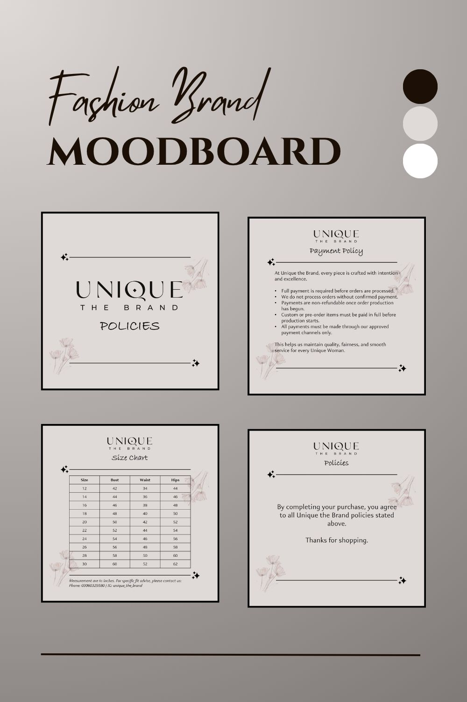

# Fashion Brand Social Kit

A social media design set created for a fashion/clothing brand to support customer communication on Instagram.

## Client
Public fashion retail brand. Client name is visible on the final deliverables shown in this project.

## Project Scope
This project includes:
- 1 size chart design
- 8 policy designs
- 2 how-to-order designs

## Goal
Create clear, visually consistent Instagram-ready posts that help customers:
- understand sizing
- review store policies
- place orders easily

## Deliverables
| Category      | Description                                         |
|--------------|-----------------------------------------------------|
| Size Chart   | 1 design                                            |
| Policies     | 8 designs covering customer-facing store policies   |
| How to Order | 2 designs explaining the ordering process           |

## Assets
- icons
- brand visual elements

## Preview

## Notes
These designs were published on the client's Instagram page as part of their customer-facing visual communication.